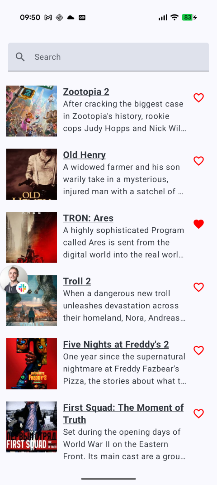
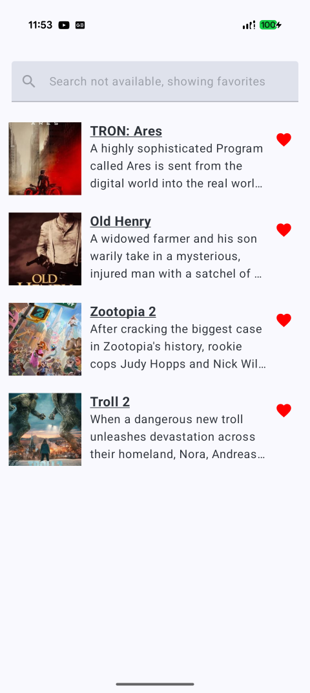
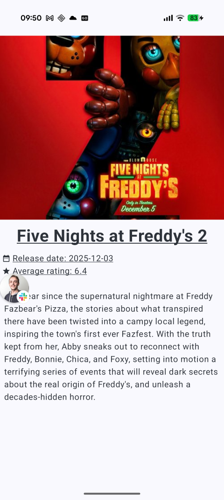

# Coders2Movies app

## App info

This project is an Android app that fetches the most popular movies from **TMDB** database on the
main screen, and also allows you to search for your favorite movie or TvSeries. This apps lists them
all, in your search results and you can mark the movies/series you like as favorites, so they can
stand out from the rest of the results, and also be accessible offline, so you can check the
movies / series even when you don't have an internet connection.

#### The main screen

This screen **initially** loads most popular movies that are currently out there. But after you type
in the search field you will get the results from the Movies and TvShows that match your query.
By pressing on the heart icon on the right on each item from the list you can mark the item as your
favourite.

### The details screen

At the details screen you can read the full description of the movie, and you can see the release
year and TMDB rating of that particular movie/series.

## How to run

1. Clone the repository
2. Open in Android Studio
3. Sync Gradle
4. Run on emulator or device (note Android OS 30+ are supported)

## Tech stack

For this project the following tech stack has been used:

- Language: Kotlin
- UI: Jetpack Compose
- Architecture: MVVM / MVI
- Dependency injection: Hilt
- Networking: Retrofit + OkHttp
- Serialization: Moshi
- Async: Kotlin Coroutines & Flow
- Persistence: Room
- Image Loading: Coil
- MockK and Turbine for Unit testing

### Author

**Darko Petkovski**
Senior Android Developer / Product architect (12+ years)

- [LinkedIn](https://www.linkedin.com/in/darko-petkovski-0012a1148/) 